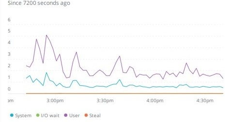
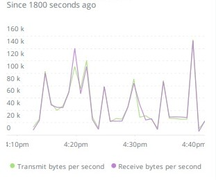
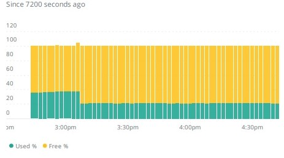
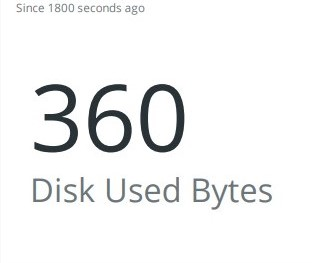
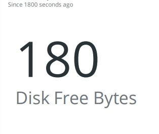

Demo of New Relic Agent Dashboard
======================

**Introduce About New Relic Agent**

A ``New relic`` agent is a piece of software that you install on a host or in an application that sends performance data to New Relic. `New Relic`_ is a Software as a Service offering that focuses on performance and availability monitoring.

.. _New Relic: http://newrelic.com

**Dashboard of Host**
-----

**Example 1:** ``CPU Usage(Max)``

.. code:: bash

    SELECT max(cpuSystemPercent) AS 'System', max(cpuIOWaitPercent) AS 'I/O wait', max(cpuUserPercent) AS 'User', max(cpuStealPercent) AS 'Steal' FROM SystemSample WHERE fullHostname = 'server.debian.com' TIMESERIES SINCE 7200 seconds ago EXTRAPOLATE

**Example 2:** ``Network Traffic/Utilization``

.. code:: bash

    SELECT latest(host.net.transmitBytesPerSecond) AS 'Transmit bytes per second', average(host.net.receiveBytesPerSecond) AS 'Receive bytes per second' FROM Metric WHERE `entityGuid` = 'MzU2NDQ4NnxJTkZSQXxOQXw2MDk1MzY3ODY2MjIwMjg1NTQ3' TIMESERIES auto

**Example 3:** ``Current Process Running``

.. code:: bash

    SELECT latest(host.process.cpuPercent) as 'CPU %', latest(host.process.threadCount) as 'Threads' FROM Metric FACET processId, processDisplayName WHERE `entityGuid` = 'MzU2NDQ4NnxJTkZSQXxOQXw2MDk1MzY3ODY2MjIwMjg1NTQ3' ORDER BY cpuPercent asc LIMIT MAX

**Example 4:** ``Memory(in percentage)``

.. code:: bash

    SELECT latest(host.memoryUsedBytes) AS 'Memory Used', latest(host.memoryFreeBytes) AS 'Memory Free' FROM Metric WHERE `entityGuid` = 'MzU2NDQ4NnxJTkZSQXxOQXw2OTI2MTI1NzY3MDQ1Njg1ODI' TIMESERIES auto

  
**Example 5:** ``Storage Used (in bytes)``

.. code:: bash

    SELECT count(diskUsedBytes) FROM SystemSample WHERE fullHostname = 'server.debian.com' SINCE 1800 seconds ago EXTRAPOLATE

  
**Example 6:** ``Storage Free (in bytes)``

.. code:: bash

    SELECT count(diskFreeBytes) FROM StorageSample WHERE fullHostname = 'server.debian.com' SINCE 1800 seconds ago EXTRAPOLATE

  
**Example 7:** ``Latest Load``

.. code:: bash

    SELECT latest(host.loadAverageOneMinute) as '1 minute', latest(host.loadAverageFiveMinute) AS '5 minutes', latest(host.loadAverageFifteenMinute) AS '15 minutes' FROM Metric WHERE `entityGuid` = 'MzU2NDQ4NnxJTkZSQXxOQXw2MDk1MzY3ODY2MjIwMjg1NTQ3' TIMESERIES auto

**Example 8:** ``CPU Usage (Latest)``

.. code:: bash

    SELECT latest(host.cpuPercent) AS 'CPU used %' FROM Metric WHERE `entityGuid` = 'MzU2NDQ4NnxJTkZSQXxOQXw2MDk1MzY3ODY2MjIwMjg1NTQ3' TIMESERIES since 10 hour ago WITH TIMEZONE 'Asia/Kolkata'
    
**Example 9:** ``Memory Free (in percent)``

.. code:: bash

    SELECT latest(host.memoryFreePercentPercent) AS 'Memory used %' FROM Metric WHERE `entityGuid` = 'MzU2NDQ4NnxJTkZSQXxOQXw2MDk1MzY3ODY2MjIwMjg1NTQ3' TIMESERIES Since 8 hour ago

**Example 10:** ``Memory Used (in percent)``

.. code:: bash

    SELECT latest(host.memoryUsedPercent) AS 'Memory used %' FROM Metric WHERE `entityGuid` = 'MzU2NDQ4NnxJTkZSQXxOQXw2MDk1MzY3ODY2MjIwMjg1NTQ3' TIMESERIES Since 8 hour ago

**Example 11:** ``Storage Usage (in percentage)``

.. code:: bash

    SELECT latest(host.disk.usedPercent) as 'Storage used %' FROM Metric WHERE `entityGuid` = 'MzU2NDQ4NnxJTkZSQXxOQXw2MDk1MzY3ODY2MjIwMjg1NTQ3' TIMESERIES since 8 hour ago    

**Example 12:** ``Disk Used (in percentage)``

.. code:: bash

    SELECT latest(host.disk.usedPercent) as 'Used %' FROM Metric FACET device WHERE `entityGuid` = 'MzU2NDQ4NnxJTkZSQXxOQXw2MDk1MzY3ODY2MjIwMjg1NTQ3' LIMIT MAX
    
    
**Example 13:** ``Memory Usage (Max)``

.. code:: bash

    SELECT max(memoryUsedBytes / memoryTotalBytes * 100) AS 'Used %', max(memoryFreeBytes / memoryTotalBytes * 100) AS 'Free %' FROM SystemSample WHERE hostname = 'server' TIMESERIES SINCE 7200 seconds ago EXTRAPOLATE
