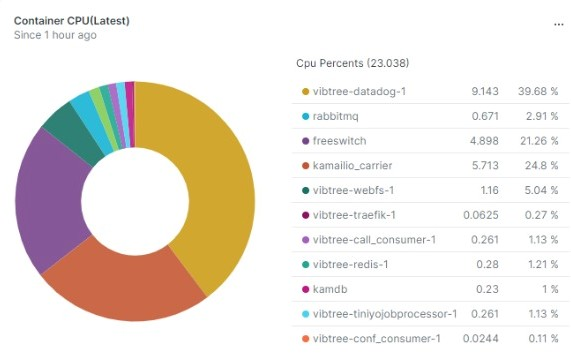

Demo of New Relic Agent Dashboard
======================

**Introduce About New Relic Agent**

A ``New relic`` agent is a piece of software that you install on a host or in an application that sends performance data to New Relic. `New Relic`_ is a Software as a Service offering that focuses on performance and availability monitoring.

.. _New Relic: http://newrelic.com

**Dashboard of Docker**
-----

**Example 1:** ``Docker Container CPU Usage(Latest)``

.. code:: bash

    FROM ContainerSample SELECT latest(cpuPercent) FACET name where host ='server' limit max

**Example 2:** ``Memory Usage(Latest)``

.. code:: bash

    FROM ContainerSample SELECT latest(memoryUsageBytes) FACET name WHERE hostname = 'server' limit max

.. image:: Images/kolkata/02_memory_usage.jpeg
  :width: 400
  :alt: Memory Usage
  :align: center

**Example 3:** ``Total Containers``

.. code:: bash

    SELECT uniqueCount(containerId) FROM ContainerSample WHERE fullHostname = 'server.debian.com' SINCE 5 minutes ago EXTRAPOLATE

.. image:: Images/kolkata/03_total_container.jpeg
  :width: 400
  :alt: Total Containers
  :align: center
  
**Example 4:** ``Container Status``

.. code:: bash

    FROM ContainerSample SELECT name, state, status, cpuShares, restartCount, storage, imageName where fullHostname ='server.debian.com'And state !='running' since 30 minute ago  LIMIT MAX

.. image:: Images/kolkata/04_container_status.jpeg
  :width: 600
  :alt: Container Status
  :align: center
  
**Example 5:** ``Network Rx/Tx(in bytes)``

.. code:: bash

    FROM ContainerSample SELECT latest(networkRxBytes), latest(networkTxBytes) WHERE host ='server' TIMESERIES AUTO 

.. image:: Images/kolkata/05_network_rx_tx.jpeg
  :width: 500
  :alt: Network Rx/Tx(in bytes)
  :align: center  
  
**Example 6:** ``Network Rx/Tx Error(in bytex)``

.. code:: bash

    FROM ContainerSample SELECT latest(networkRxErrors), latest(networkTxErrors) where host ='server' TIMESERIES AUTO SINCE today

.. image:: Images/kolkata/06_network_rx_tx_error.jpeg
  :width: 500
  :alt: Network Rx/Tx Error(in bytex)
  :align: center
  
**Example 7:** ``Available Containers``

.. code:: bash

    SELECT uniqueCount(containerId) FROM ContainerSample WHERE fullHostname = 'server.debian.com' TIMESERIES AUTO SINCE today
