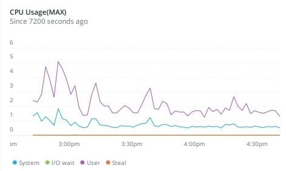
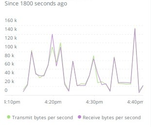
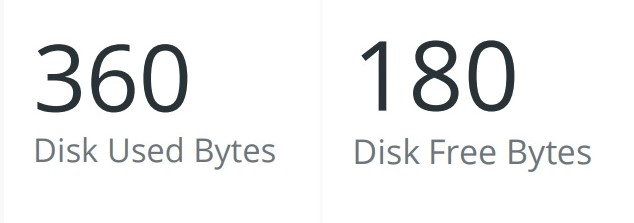

Demo of New Relic Agent Dashboard
======================

**Introduce About New Relic Agent**

A ``New relic`` agent is a piece of software that you install on a host or in an application that sends performance data to New Relic. `New Relic`_ is a Software as a Service offering that focuses on performance and availability monitoring.

.. _New Relic: http://newrelic.com

**Dashboard of Host**
-----

**Example 1:** ``CPU Usage``

.. code:: bash

    SELECT latest(host.cpuPercent) FROM Metric WHERE `entityGuid` = 'MzU2NDQ4NnxJTkZSQXxOQXw2OTI2MTI1NzY3MDQ1Njg1ODI' TIMESERIES auto

**Example 2:** ``Network Traffic``

.. code:: bash

    SELECT latest(host.net.transmitBytesPerSecond) AS 'Transmit bytes per second', latest(host.net.receiveBytesPerSecond) AS 'Receive bytes per second' FROM Metric WHERE `entityGuid` = 'MzU2NDQ4NnxJTkZSQXxOQXw2OTI2MTI1NzY3MDQ1Njg1ODI' TIMESERIES auto

**Example 3:** ``Process Running``

.. code:: bash

    SELECT latest(host.process.cpuPercent) as 'CPU %', latest(host.process.threadCount) as 'Threads' FROM Metric FACET processId, processDisplayName WHERE `entityGuid` = 'MzU2NDQ4NnxJTkZSQXxOQXw2OTI2MTI1NzY3MDQ1Njg1ODI' ORDER BY cpuPercent asc LIMIT MAX

.. image:: Images/03_process_running.jpg
  :width: 400
  :alt: Process Running
  :align: center

**Example 4:** ``Memory(in bytes)``

.. code:: bash

    SELECT latest(host.memoryUsedBytes) AS 'Memory Used', latest(host.memoryFreeBytes) AS 'Memory Free' FROM Metric WHERE `entityGuid` = 'MzU2NDQ4NnxJTkZSQXxOQXw2OTI2MTI1NzY3MDQ1Njg1ODI' TIMESERIES auto

.. image:: Images/04_memory.jpg
  :width: 400
  :alt: Memory
  :align: center
  
**Example 5:** ``Storage(in bytes)``

.. code:: bash

    SELECT Latest(host.disk.usedBytes) as 'Storage used', latest(host.disk.freeBytes) As 'Storage Free' FROM Metric WHERE `entityGuid` = 'MzU2NDQ4NnxJTkZSQXxOQXw2OTI2MTI1NzY3MDQ1Njg1ODI' TIMESERIES auto

.. image:: Images/06_storage.jpg
  :width: 400
  :alt: Storage
  :align: center
  
**Example 6:** ``Disk Usage``

.. code:: bash

    SELECT latest(host.disk.usedPercent) as 'Used %' FROM Metric FACET device WHERE `entityGuid` = 'MzU2NDQ4NnxJTkZSQXxOQXw2OTI2MTI1NzY3MDQ1Njg1ODI' LIMIT MAX 

  
**Example 7:** ``Latest Load``

.. code:: bash

    SELECT latest(host.loadAverageOneMinute) as '1 minute', latest(host.loadAverageFiveMinute) AS '5 minutes', latest(host.loadAverageFifteenMinute) AS '15 minutes' FROM Metric WHERE `entityGuid` = 'MzU2NDQ4NnxJTkZSQXxOQXw2OTI2MTI1NzY3MDQ1Njg1ODI' TIMESERIES auto

.. image:: Images/07_latest_load.jpg
  :width: 400
  :alt: Latest Load
  :align: center
