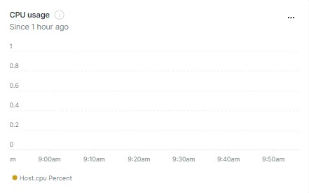

Demo of New Relic Agent Dashboard
======================

**Introduce About New Relic Agent**

A ``New relic`` agent is a piece of software that you install on a host or in an application that sends performance data to New Relic. `New Relic`_ is a Software as a Service offering that focuses on performance and availability monitoring.

.. _New Relic: http://newrelic.com

**Dashboard**
-----

**Example 1:** ``CPU Usage``

.. code:: bash

    SELECT latest(host.cpuPercent) FROM Metric WHERE `entityGuid` = 'MzU2NDQ4NnxJTkZSQXxOQXw2OTI2MTI1NzY3MDQ1Njg1ODI' TIMESERIES auto

